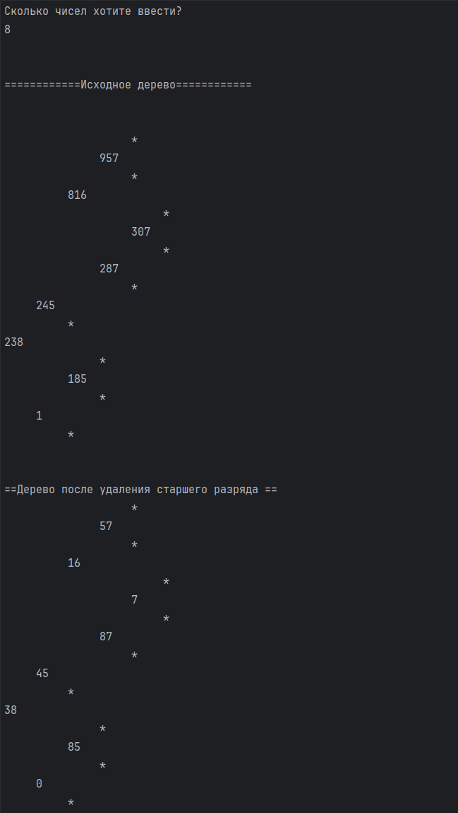

# Микрюков Егор ИТС-2 Лабораторная №4
# Задание 1
## Задача 1
### Текст задачи
Дерево содержит целые числа. Удалить старший разряд в каждом числе.
### Алгоритм решения

1. Определить тип бинарного дерева поиска:
   - Empty — пустое дерево
   - Node — узел, содержащий значение и ссылки на левое и правое поддеревья
2. Реализовать функцию вставки элемента в дерево:
   - Если дерево пусто — создать новый узел
   - Если вставляемое значение меньше значения узла — рекурсивно вставить в левое поддерево
   - Если больше — вставить в правое поддерево
   - Если равно — вернуть существующий узел (без изменений)
3. Реализовать функцию удаления старшего разряда числа:
   - Если число меньше 10 — вернуть 0
   - Иначе преобразовать число в строку, создать новую строку без первого символа и преобразовать обратно
4. Реализовать рекурсивную функцию преобразования дерева:
   - Обойти дерево, применяя функцию удаления старшего разряда к каждому значению
   - Сохранить структуру дерева (левое и правое поддеревья не меняются)
5. Реализовать ввод данных:
   - Запросить количество чисел
   - Запросить число и выполнить проверку корректности ввода
   - Вызвать функцию вставки
   - Запросить число и выполнить проверку корректности ввода
6. Вывести результаты:
   - Исходное дерево
   - Преобразованное дерево

